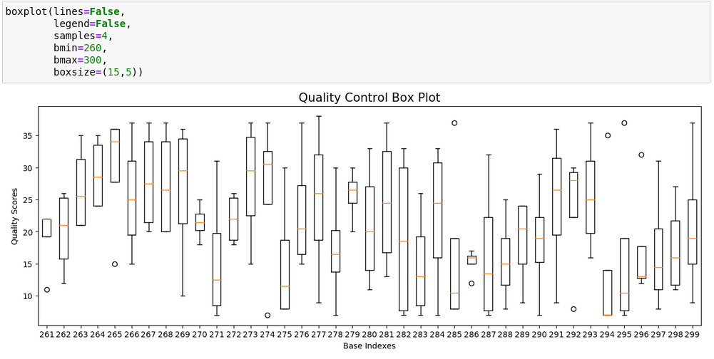
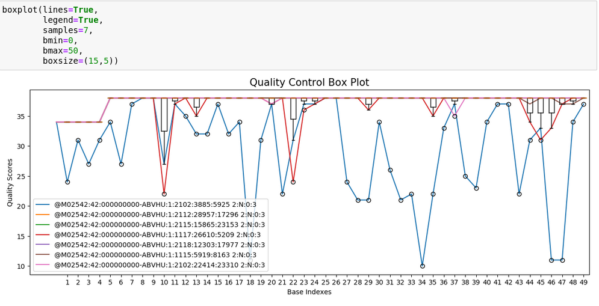
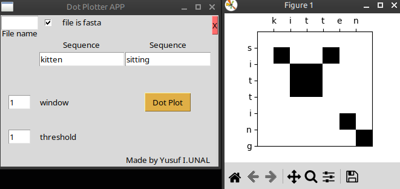
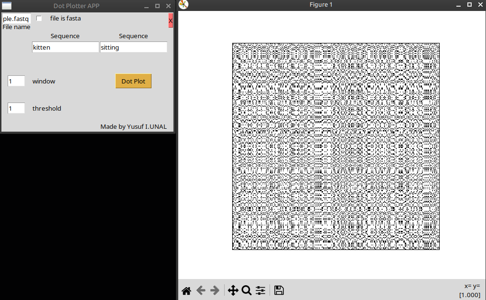
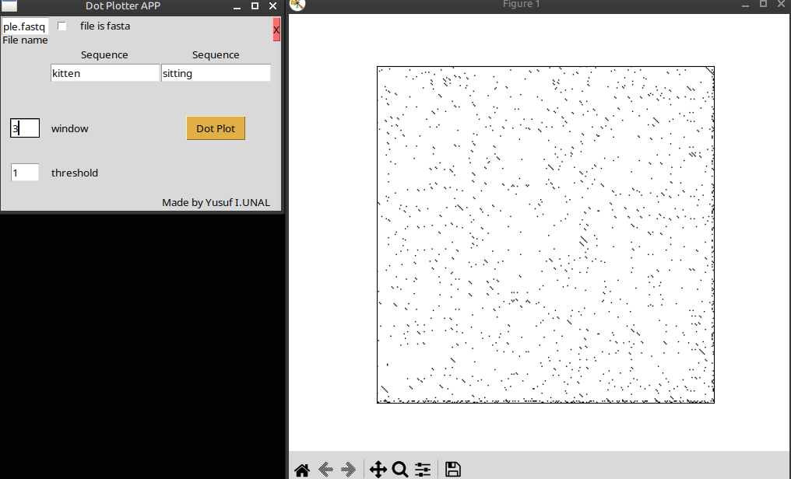

# Bioinformatics Assignment1
Fastq to fasta, quality control box plot and dot matrix App

## Contributors
**thatrollercoaster**: Beyza Görmüş

**jsphu**: Yusuf Ünal

### Examples of boxplot _jsphu_ 
#### Only boxplots of bases between index numbers of *260 and 300* of unique *4 samples* 

#### Linear plots and boxplots first *50* bases of unique *7 samples* with the legend.  

### Examples of dotmatrixApp *jsphu*
#### *kitten and sitting* dot squares

#### *2 different sequences of 300 bases inside of a .fastq file* dot squares

#### Same with above but *window* option changed to *3*

